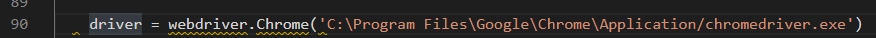
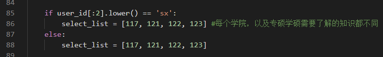
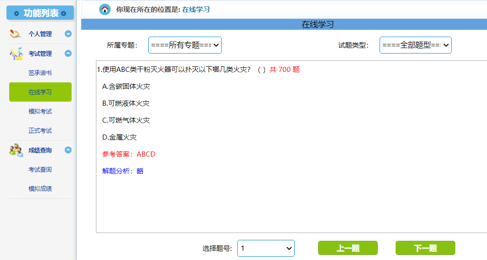

# Note

本仓库fork自[Kabibi](https://github.com/Kabibi)/**[Pass-Nuaa-Lab-Exam](https://github.com/Kabibi/Pass-Nuaa-Lab-Exam)**

主要针对页面改动进行相应修改。

## 备注

1. 下载chrome

2. 下载[最新的chromedriver](http://npm.taobao.org/mirrors/chromedriver/) 

​	并更改代码中的chromedriver为你的路径下的地址



3. 针对不同的学院，需要更改代码中select_list中的序号，具体查下图中的所有专题

   

   

4. 题库中没有的题目，程序进行暂停，自己选好选项后，在程序执行的cmd界面按任意键，程序继续。

5. 正式考试会弹出一个alert弹出框，目前处理是程序暂停，手动点确定，然后让程序继续运行。


# 以下是原readme


# 一分钟通过南航的实验室考试

## 简介 

南航的[实验室考试系统](http://aqzsxx.nuaa.edu.cn/)给研究生同学们带来了极大的困扰。尤其是要牺牲自己宝贵的学习和恋爱的时间去完成这种没有意义的考试。

因此，这个项目为解决这一问题而诞生。让大家能够在1分钟之内获得考试的合格证。


## 使用方法

1. 执行下列命令获得本项目的源代码。(或在网页版点击下载本项目的源代码)
```shell
git clone git@github.com:Kabibi/Pass-Nuaa-Lab-Exam.git 
```

2. 安装依赖
```shell
pip install -r requirements.txt
```

3. 修改 [main.py](./main.py)下面的登录信息。填入学号，登录密码，以及考试页面的链接，即可在一分钟之内，以95分以上的成绩完成一次模拟考试。

```python
if __name__ == '__main__':
    
    take_exam(user_id='sx1801001',  # 学号
              password='123456',  # 密码
              ans_file='key.xls',  # 答案文件
              exam_url='http://aqzsxx.nuaa.edu.cn/PersonInfo/StartJobOne.aspx?PaperID=267&UserID=24424&Start=yes')  # 模拟考试或正式考试页面的链接
```

其中 exam_url 填入下图所示红色区域内容：


## 常见问题

1. chromedriver 的安装问题，需要把 executable_path 修改为安装chromedriver.exe的路径。详细见[stackoverflow](https://stackoverflow.com/questions/42478591/python-selenium-chrome-webdriver')的解答。

```python
driver.Chrome(executable_path=r"C:\path\to\chromedriver.exe")
```


## 其他说明

由于不同学院的题库不同，所以项目中提供的题库`key.xls`并非能够总能够让你及格。

如果考试不及格，可以先获取题库的试题，然后使用爬取的题库进行考试。
```python
if __name__ == '__main__':
    # 爬取题库的答案
    get_answer('sx1801001', '123456', write_to='my_key.xls')

    # 模式考试
    take_exam(user_id='sf180001',  # 学号
              password='123456',  # 密码
              ans_file='my_key.xls',  # 答案文件
              exam_url='http://aqzsxx.nuaa.edu.cn/PersonInfo/StartExamOne.aspx?PaperID=69&UserID=28409&Start=yes')  # 模拟考试或正式考试页面的链接
```
